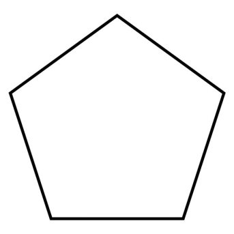
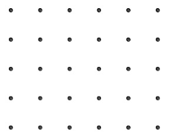

## Setting up the ROS project

After cloning the repository, its submodules have to be initialized and cloned
recursively:

```bash
git submodule update --init --recursive
```

The ROS project can be compiled afterwards:

```bash
source /opt/ros/melodic/setup.bash
cd catkin_ws
catkin_make
```


## Instructions for run the simulation and offboard node

Open 3 different terminals, and run the following commands, one on each of them.

Remember to source the ROS project setup file beforehand with the following
instruction:


```bash
cd <ros-project-path>/devel
source ./setup.bash
```

1. Launch gazebo

    ```bash
    cd src/Firmware
    make posix_sitl_default gazebo
    ```

2. Launch MavROS

    ```bash
    roslaunch mavros px4.launch fcu_url:="udp://:14540@192.168.1.36:14557"
    ```
3. Launch the offboardnode

    ```bash
    roslaunch offboardnode offboardnode.py
    ```


## Initializing Pattern (Package: Formation Control)

The *formation_control* package creates the coordinates, calculates the distances, and creates the links between drones in a desired shape. The formations currently supported are polygon, grids, and v-shape.

  

